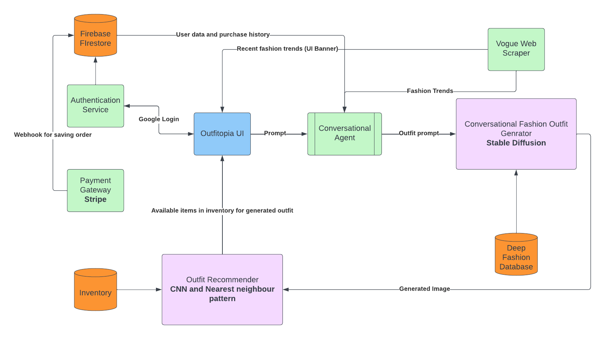

# Outfitopia

> Hackathon Submission: Outfitopia - Revolutionizing Personalized Fashion with Gen AI

# Introduction

Outfitopia is a groundbreaking __Gen AI-powered__ fashion outfit generator that redefines the way users discover and curate personalized fashion ensembles through natural conversational interactions. Developed exclusively for Flipkart, Outfitopia leverages users' historical purchase data, preferences gleaned from browsing habits, and real-time insights from social media trends to provide tailor-made, on-trend outfit recommendations.

# Product Description

Outfitopia emerges as a trailblazing solution in the realm of fashion technology. It combines the power of artificial intelligence and fashion expertise to create a seamless shopping experience that resonates with individual users. By employing a state-of-the-art Gen AI algorithm, Outfitopia generates outfits through stable diffusion, boasting innovative properties such as upscaling, reload, and regenerate, ensuring that each recommendation is both relevant and innovative.

## Key Features

1. **Gen AI-Based Outfit Generation:** Outfitopia's core functionality lies in its Gen AI-powered outfit generation. This process, built on the principles of stable diffusion, ensures that the generated outfits not only match users' preferences but also offer a creative twist that aligns with current fashion trends. The algorithm's unique upscaling, reload, and regenerate properties enhance the variety and freshness of recommendations.

2. **Outfit Modifications on the Fly:** Outfitopia takes personalization to a new level by enabling users to make modifications and changes to generated outfits through natural language. Users can request alterations to specific clothing items, colors, styles, or even entire outfit combinations. The AI responds intelligently, offering alternatives and adjustments based on user input.

3. **Outfit Recommender:** Complementing the outfit generator is the outfit recommender, which curates product recommendations based on the generated outfits. This synergy between generation and recommendation provides users with a holistic shopping experience, making it effortless to translate inspiration into a tangible wardrobe.

4. **Authentication and Billing Services:** Outfitopia prioritizes user security and convenience. Authentication is facilitated through Google Auth, ensuring that user data remains safeguarded. Furthermore, seamless payment transactions are enabled by Stripe, offering a secure and efficient billing process.

5. **Deep Fashion Database:** The foundation of Outfitopia's AI prowess is the utilization of a comprehensive Deep Fashion Database. This database is harnessed for training the AI model, enabling it to understand intricate fashion nuances, styles, and trends.

6. **Vogue Fashion Trends Integration:** Keeping pace with the dynamic nature of fashion, Outfitopia incorporates Vogue fashion trends to stay abreast of the latest style evolutions. This integration ensures that recommendations are not just relevant but also aligned with the most current fashion sensibilities.

## High level architecture

## Conclusion

Outfitopia marks a pivotal turning point in fashion e-commerce. By seamlessly fusing cutting-edge technology, fashion expertise, and user-centric design, it delivers a personalized shopping experience that transcends traditional boundaries. With its Gen AI-powered outfit generation, outfit recommender, robust authentication and billing services, and integration with reputable fashion sources like Vogue, Outfitopia is poised to revolutionize the way users engage with fashion, making every shopping journey a memorable and tailored experience.

_We look forward to the opportunity to showcase Outfitopia's capabilities and innovation in the hackathon, and we're excited about the potential for this product to shape the future of fashion e-commerce._

**Team Outfitopia**
[Harshpreet Singh Johar](https://github.com/harshjohar)
[Abhinav Rawal](https://github.com/rawalabhinav)
[Manjot Singh Oberoi](https://github.com/ken1000minus7)
